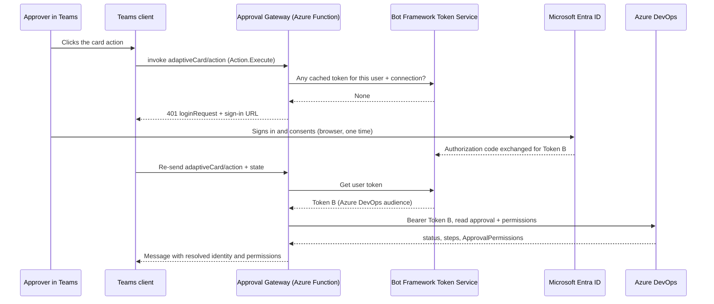
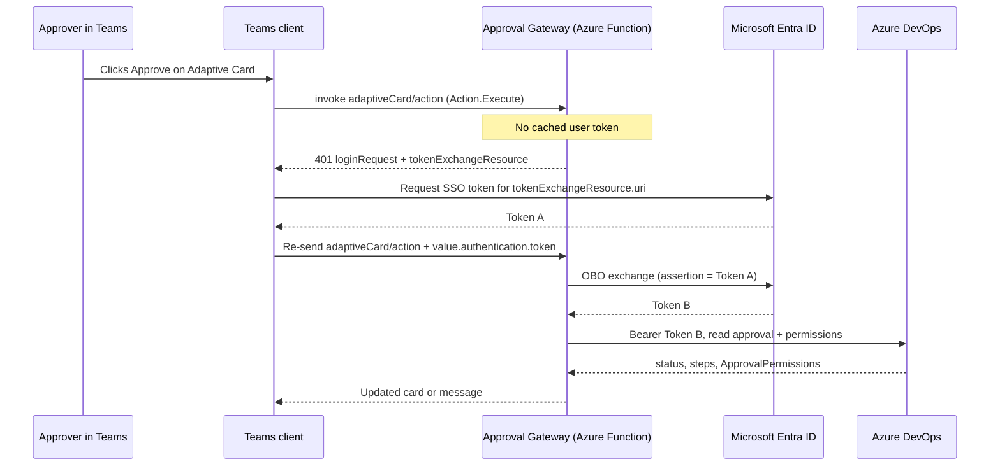

# Architect decision brief — Teams approval identity

> Status: **awaiting architect decision**.
>
> Date: 2026-08-26
>
> Audience: solution / security architect reviewing the Approval Gateway POC.
>
> Update 2026-08-26: an architecture spike was added at the end of this document. It evaluates whether the native Microsoft Azure Pipelines app for Teams removes the need for a custom approval path, and validates the delegated Teams SSO + On-Behalf-Of design. Read the spike before answering the decision below — it narrows Option B, changes what the gateway's approver matching is for, and establishes that **OBO is not required for the first proof**: a nominal Bot Framework OAuth connection reaches Azure DevOps with the user's own delegated token and no exchange code, which is what the next checkpoint (`AUTH-1`) uses.

## Purpose

Document the POC state after the first end-to-end approval attempt, the identity problem discovered when applying approvals from Teams, and the viable options so an architect can choose the next path.

This document does **not** choose the production approach. It records facts and trade-offs.

## Non-negotiable constraints (already agreed for the POC)

1. **Azure DevOps is the approval authority** — approvers, pending state, authorization, environment protection, and audit live in ADO.
2. **Teams is UI only** — notification and interaction surface; not a second approval system.
3. **Card payload is untrusted** — `approvalId` / action data are correlation hints only; gateway must re-read ADO before any decision.
4. **No fail-open** — Teams/gateway failure must leave the ADO approval pending.
5. **HML-only runs must not create PRD approval activity** — PRD stage is compile-time gated (`${{ if eq(parameters.promoteToPrd, true) }}`).

## What the POC has proven

| Capability | Result |
|---|---|
| Pipeline HML-only (PRD absent from graph) | Proven (run 127) |
| Pipeline with `promoteToPrd=true` → Environment approval on `prd-teams-poc` | Proven |
| Service Hook `approval-pending` → Function webhook | Proven |
| Persist Teams conversation reference in Blob (Flex scale-out safe) | Proven |
| Proactive Adaptive Card to personal Teams chat | Proven |
| Gateway re-reads ADO approval + Environment approver policy | Proven in code / tests |
| Apply approval via REST `PATCH /_apis/pipelines/approvals` | Proven — **with wrong audit identity** (see below) |

### Runtime inventory (POC)

- Function App: `func-ado-teams-poc-diegolab`
- Host: `https://func-ado-teams-poc-diegolab-b5crbkdncmcqb6a6.eastus2-01.azurewebsites.net`
- Azure Bot + Teams personal app installed
- Environment: `prd-teams-poc` (approvers include `approver@diegolab.onmicrosoft.com` and Diego for testing)
- Service Hook: `approval-pending`, filtered to `prd-teams-poc`

## The identity problem (blocker for in-Teams approve)

### Symptom

User clicked Approve in Teams as **Approver POC**. Azure DevOps audit showed:

```text
Diego Fernandes
Approved • …
Approved from Microsoft Teams (Approval Gateway POC).
```

### Root cause

`PATCH` Approvals authenticates with a **single service PAT** (`AzureDevOps__Pat`, Diego’s token). Azure DevOps records the **token owner**, not the Teams clicker. There is **no API field** to attribute the approval to another user while authenticating as a service account.

```text
Teams click (Approver POC)
        |
        v
Gateway validates caller against Environment approvers
        |
        v
PATCH Approvals with Diego PAT
        |
        v
ADO audit = Diego Fernandes   ← wrong
```

This is an Azure DevOps platform behavior, not a Teams bug.

### Rejected approach (do not pursue)

**Per-approver PATs stored in the gateway** (map email → PAT, PATCH with that PAT).

Why rejected for this org/POC:

- Gateway would hold long-lived credentials of every human approver
- Operationally and security-wise unacceptable at scale
- Does not match “user already logged into Teams” expectation

## Current code posture (after correction)

To avoid shipping a false “approve in Teams” UX that lies about who approved:

1. **Adaptive Card** for real approvals uses **`Action.OpenUrl`** → “Review in Azure DevOps” (run results URL).
2. Gateway **does not apply** approvals with the service PAT.
3. Service PAT remains **read-only** (GET approval / Environment policy) when needed.
4. Legacy `Action.Execute` approve/reject paths (old cards / POC fake card) either acknowledge locally or tell the user to use the ADO link for real approvals.
5. Client API shape allows a future **Bearer user token** on `UpdateApprovalAsync` (delegated auth), without storing approver PATs.

Deployed behavior matches this posture.

## Options for architect decision

### Option A — Deep link only (current POC default)

**UX:** Teams notifies → user opens ADO → approves with their own ADO session.

| Pros | Cons |
|---|---|
| Correct audit immediately | Leaves Teams for the decision |
| Minimal Entra / Bot complexity | Weak “approve in chat” story |
| No delegated token plumbing | |

**Fit:** notification POC; prove correlation and delivery only.

---

### Option B — delegated user token to Azure DevOps *(recommended candidate for in-Teams approve)*

**UX:** User clicks Approve in Teams → gateway obtains an Azure DevOps token belonging to that user → `PATCH` with `Authorization: Bearer` → audit shows the clicker.

> Refined by the spike: the diagram below is on-ramp `SSO` (Teams SSO + OBO). The spike identified a cheaper on-ramp `NOMINAL` (Bot Framework OAuth sign-in) that reaches the same Azure DevOps token with no exchange step, and that is what `AUTH-1` implements. See *On-ramp options* in section B of the spike.

```text
Teams (user already signed in to Entra)
        |
   Bot SSO / OAuth connection
        |
   Access token for bot API (user)
        |
   OBO exchange
        |
   Azure DevOps token (delegated, user)
        |
   PATCH Approvals
        |
   ADO audit = that user
```

Required platform work (not done):

- Entra App Registration: Azure DevOps **delegated** permission (e.g. `vso.pipelineresources_use` / `.default`)
- Azure Bot: OAuth connection (AAD v2) + token exchange URL
- Teams manifest: `webApplicationInfo`, `validDomains` including `token.botframework.com`
- Gateway: obtain user token on `Action.Execute`, call ADO with Bearer
- Consent: first use may prompt; admin consent may be preferred in production

| Pros | Cons |
|---|---|
| Keeps decision inside Teams | Non-trivial Entra + Bot + manifest work |
| Correct ADO audit | One-time consent / admin consent |
| No human PATs in gateway | OBO failure modes and token refresh to design |
| Aligns with Microsoft guidance for bots calling APIs as the user | Larger POC surface |

**Fit:** product direction if “approve without leaving Teams” is a hard requirement.

---

### Option C — Hybrid

Card always deep-links for authority (A), plus optional in-Teams approve after SSO (B) when token available.

| Pros | Cons |
|---|---|
| Fallback if SSO fails | Two interaction paths to support |
| Safer progressive delivery | More UX/copy complexity |

---

### Option D — Out of scope / not recommended

- Service principal / managed identity applying approvals “as the system” while faking human identity — **not supported** for correct human audit.
- Trusting Teams display name alone as authorization without ADO token — identity matching is useful for UX gates, **not** for who ADO records as approver.

## Explicit non-goals for this decision

- GMUD / SharePoint enrichment (see `docs/future-gmud-context-enrichment.md`)
- `approval-completed` Service Hook / card lifecycle updates
- Multi-approver routing directories / group chat
- Publishing Teams app to org catalog

## Recommendation input for the architect (not a decision)

From the engineering POC perspective:

- If the product must keep **approve/reject inside Teams with correct ADO audit**, **Option B** is the only scalable, honest path.
- If the near-term goal is only **reliable notification + correct authority**, keep **Option A** and stop claiming in-Teams approval until B lands.
- Do **not** reintroduce per-approver PATs.

## Decision requested

Please choose one:

1. **Stay on Option A** (deep link) for the remainder of the POC; document as intentional UX.
2. **Authorize Option B** (delegated user token → ADO) as the next implementation slice. Per the spike, the first slice is `AUTH-1`: a nominal Bot Framework OAuth connection and a read-only ADO call. Entra app registration and Bot OAuth connection only — no manifest change, no OBO code, no SSO configuration.
3. **Authorize Option C** (hybrid) with an explicit MVP order (A first, then B).

Record the decision below when made:

```text
Decision:     (A / B / C)
Date:         …
Decided by:   …
Notes:        …
```

---

# Architecture spike — native Teams app vs delegated SSO + OBO

> Date: 2026-08-26
>
> Type: **architecture spike — analysis only**. No code, App Registration, Bot OAuth, manifest, Bicep, Service Hook, or Azure DevOps Environment changes were made.
>
> Question: do we actually need to build delegated Teams SSO + OBO, or does the native Microsoft **Azure Pipelines app for Teams** already satisfy our exact use case?

## Method

Code and configuration inspected:

- [src/ApprovalGateway/AzureDevOps/AdoApprovalsClient.cs](../src/ApprovalGateway/AzureDevOps/AdoApprovalsClient.cs)
- [src/ApprovalGateway/AzureDevOps/AdoApprovalDecisionService.cs](../src/ApprovalGateway/AzureDevOps/AdoApprovalDecisionService.cs)
- [src/ApprovalGateway/AzureDevOps/TeamsCallerIdentity.cs](../src/ApprovalGateway/AzureDevOps/TeamsCallerIdentity.cs)
- [src/ApprovalGateway/AzureDevOps/AdoApprovalsOptions.cs](../src/ApprovalGateway/AzureDevOps/AdoApprovalsOptions.cs)
- [src/ApprovalGateway/Bot/AdoApprovalCard.cs](../src/ApprovalGateway/Bot/AdoApprovalCard.cs)
- [src/ApprovalGateway/Bot/ApprovalGatewayAgent.cs](../src/ApprovalGateway/Bot/ApprovalGatewayAgent.cs)
- [teams/appPackage/manifest.json](../teams/appPackage/manifest.json)
- [infra/modules/bot.bicep](../infra/modules/bot.bicep)
- [azure-pipelines.yml](../azure-pipelines.yml)

Microsoft documentation used (all read at spike time):

| Topic | Source |
|---|---|
| YAML Environment Approvals & Checks | `learn.microsoft.com/azure/devops/pipelines/process/approvals` |
| Approvals REST API — Update (scopes, `actualApprover`) | `learn.microsoft.com/rest/api/azure/devops/approvalsandchecks/approvals/update` |
| Approvals REST API — Query (`$expand=permissions`) | `learn.microsoft.com/rest/api/azure/devops/approvalsandchecks/approvals/query` |
| Azure Pipelines app for Teams (page currently unavailable; read via Wayback snapshot `20250303234614` of the 2024-10-31 revision) | `learn.microsoft.com/azure/devops/pipelines/integrations/microsoft-teams` |
| Azure Pipelines app for Slack (current sibling, revised 2026-01-13) | `MicrosoftDocs/azure-devops-docs` → `docs/pipelines/integrations/slack.md` |
| Azure DevOps ↔ Teams integration overview | `MicrosoftDocs/azure-devops-docs` → `docs/service-hooks/services/teams.md`; `service-hooks/services/workplace-messaging-apps` |
| Microsoft Entra OAuth for Azure DevOps (resource ID, `.default`) | `learn.microsoft.com/azure/devops/integrate/get-started/authentication/entra-oauth` |
| Azure DevOps OAuth scopes + deprecation | `learn.microsoft.com/azure/devops/integrate/get-started/authentication/oauth`, `.../azure-devops-oauth` |
| Organization application-access policies | `learn.microsoft.com/azure/devops/organizations/accounts/change-application-access-policies` |
| OAuth 2.0 On-Behalf-Of flow | `learn.microsoft.com/entra/identity-platform/v2-oauth2-on-behalf-of-flow` |
| Teams bot SSO overview / Entra config / manifest | `MicrosoftDocs/msteams-docs` → `bots/how-to/authentication/bot-sso-overview.md`, `bot-sso-register-aad.md`, `bot-sso-manifest.md` |
| Adaptive Cards Universal Actions — SSO and third-party auth | `MicrosoftDocs/msteams-docs` → `task-modules-and-cards/cards/Universal-actions-for-adaptive-cards/{sso-adaptive-cards-universal-action,enable-sso-for-your-adaptive-cards-universal-action,authentication-flow-in-universal-action-for-adaptive-cards}.md` |
| `.default` scope semantics | `learn.microsoft.com/entra/identity-platform/scopes-oidc` |
| Azure Bot OAuth connections — providers, Scopes field, Token Exchange URL, separate app per secured resource | `learn.microsoft.com/azure/bot-service/bot-builder-authentication`, `.../bot-builder-concept-authentication` |

Internal precedent used as evidence (not Microsoft documentation): a prior Backstage POC in this organization that authenticated users through Microsoft Entra ID and called Azure DevOps REST APIs with the signed-in user's delegated token, subject to that user's own Azure DevOps permissions. Cited in confirmation 5 of section B.

## A. Native Azure Pipelines Teams app verdict

### Verdict: `PARTIALLY SUFFICIENT`

It genuinely covers **YAML Environment approvals approved from Teams** — which is more than the earlier POC assumption credited it with. It fails on **delivery surface** (channel only, explicitly not personal chat) and on **card extensibility** (no GMUD/custom-context extension point). Those two gaps are structural, not configuration.

### Capability-by-capability evidence

| Requirement | Verdict | Evidence |
|---|---|---|
| Azure DevOps YAML pipeline | Supported | Both the archived Teams doc and the current Slack doc list YAML-specific subscriptions: `Run state changed` / `Run stage state changed` and `Run stage waiting for approval` |
| Environment-based Approvals & Checks | Supported | `Run stage waiting for approval` is raised by the Approval check on a protected resource; environments are the documented resource for manual approval |
| Pending Environment approval notification | Supported | Created by default on `subscribe`; stage and environment filters available |
| Approve / reject directly from Teams | Supported — **channel only** | Archived doc, *Approve from your channel*: "If you're an approver, you can approve deployments from within your Teams channel. The Azure Pipelines app supports all Azure Pipelines checks and approval scenarios." |
| Correct Azure DevOps human audit identity | Expected, **not documented** | Each user runs `@azure pipelines signin` and authenticates their own Azure DevOps identity, so the app acts under the individual's delegated authorization. No Microsoft doc states what identity is written to the approval record. Must be proven empirically before being claimed. |
| Personal chat / personal notification | **Not supported** | Archived doc, verbatim: "Azure Pipelines notifications aren't supported inside Teams chat or direct messages." |
| Our PRD Environment approval type | Supported, with a ceiling | Archived doc: "You can't subscribe to deployment approvals that have the `Revalidate identity of approver before completing the approval` policy applied." That policy is a **Classic Release** pre-deployment approval option (re-sign-in before approving); the YAML Environment Approval check has no equivalent setting, so `prd-teams-poc` is unaffected today. It does mean the native app cannot ever carry a step-up-auth approval. |
| Compatibility with explicit production promotion | Supported — guaranteed by the pipeline, not the app | The app subscribes to events; because the PRD stage is compile-time gated by `${{ if eq(parameters.promoteToPrd, true) }}` in [azure-pipelines.yml](../azure-pipelines.yml), HML-only runs never raise an approval event. Principle 10 is preserved by the pipeline in both architectures. |
| Enrich approval UI with future GMUD context | **Not supported** | First-party fixed card. No documented extension point for adding fields, links, or external context. |
| Correlate / display custom application or run information | **Not supported** beyond built-in fields | Same reason. Subscription **filters** are configurable; card **content** is not. |
| Handle completion when someone approves directly in ADO | Partially / ambiguous | `Run stage approval completed` subscription posts a completion notification to the channel. Whether the original actionable card is updated or disabled in place is not documented. |

### Distinctions the spike deliberately kept separate

- **Classic Release approvals** — subscription event `Release deployment approval pending`. Historically the only documented approve-from-chat path; this is what most third-party blog posts demonstrate. Not our architecture.
- **YAML Environment Approvals & Checks** — subscription event `Run stage waiting for approval`. This *is* our architecture, and it *is* supported by the app. Earlier assumptions that in-chat approval was Classic-only were wrong.
- **Azure Pipelines Teams app channel notifications** — supported, actionable, channel-scoped.
- **Personal Teams messaging** — explicitly out of scope for the native app.
- **Native actionable approvals** — real, but only inside a channel, on a non-extensible card.

### Additional risks discovered about the native app

1. **Its documentation page is currently unavailable.** `learn.microsoft.com/azure/devops/pipelines/integrations/microsoft-teams` returns HTTP 200 but serves the unrelated *"Manage Microsoft 365 connectors and custom connectors"* article (canonical URL `learn.microsoft.com/microsoftteams/m365-custom-connectors`). The source file `docs/pipelines/integrations/microsoft-teams.md` is **absent** from the public `MicrosoftDocs/azure-devops-docs` repository, while `docs/boards/integrations/boards-teams.md`, `docs/repos/integrations/repos-teams.md`, and `docs/pipelines/integrations/slack.md` (revised 2026-01-13) all remain. There is no Wayback snapshot after 2025-03-03. Other Learn pages still link to the missing page as a recommended integration. **This is not evidence of retirement** and no retirement announcement was found — but for a production PRD approval path it is an unacceptable level of documentation uncertainty without direct hands-on validation.
2. **It appears to sit on the deprecated Azure DevOps OAuth platform.** The archived doc lists as a prerequisite: *"Third party application access via OAuth enabled in Azure DevOps organizational settings."* Per the organization policy doc, that policy governs **Azure DevOps OAuth apps** and "doesn't affect Microsoft Entra ID OAuth app access". Azure DevOps OAuth is deprecated: no new app registrations since April 2025, full deprecation scheduled for 2026. The policy also defaults to **off** for all new organizations, so enabling it is a deliberate org-wide security posture change.
3. **Tenant coupling.** Only Azure DevOps organizations in the same Microsoft Entra tenant as the Teams account can be connected; the app also documents an unsupported case (Teams tenant1 / ADO non-default tenant3).
4. **Subscription authority.** Creating subscriptions requires Project Administrator (or Build Administrator) permissions, and Team Administrators cannot remove or modify subscriptions created by Project Administrators.

### Explicitly ambiguous / unverified

- What identity Azure DevOps records as the approver when the approval is applied through the native app. Undocumented.
- Whether the notification card is updated when the approval completes elsewhere. Undocumented.
- Current availability and support status of the Teams variant of the app. Undocumented at spike time.

## B. Delegated SSO + OBO verdict

### Verdict: `VIABLE WITH CONSTRAINTS`

The proposed chain is technically sound and matches documented Microsoft flows end to end. Every link has a first-party document. The constraints are real but all are configuration and tenant-governance items, not platform blockers. The one item that remains genuinely unproven *for this codebase* is the *audit outcome* — though an internal precedent now exists (see confirmation 5), which is why the next checkpoint can be read-only and cheap.

**Important refinement over the original proposal:** OBO is only required for the *silent* on-ramp. Teams also supports a nominal (interactive) sign-in on-ramp in which the Bot Framework Token Service runs a normal authorization code flow against the Azure DevOps scopes and hands the gateway an Azure DevOps token directly — no OBO code at all. See *On-ramp options* below; this changes the shape of the next checkpoint.

### Confirmations requested

| # | Question | Answer |
|---|---|---|
| 1 | Is OBO supported for this flow? | **Yes, and it is only one of three valid on-ramps.** The Teams SSO token is issued with `aud` = our own app, which is precisely OBO's requirement ("This token must have an audience (`aud`) claim of the app making this OBO request"). See *On-ramp options* below for the three variants and which one the next checkpoint uses. |
| 2 | Azure DevOps resource / application ID | Resource identifier `499b84ac-1321-427f-aa17-267ca6975798`; resource URI `https://app.vssps.visualstudio.com`. |
| 3 | Delegated permission needed to update approvals | **`vso.pipelineresources_use`** — "Grants the ability to approve a pipeline's request to use a protected resource: agent pool, **environment**, queue, repository, secure files, service connection, and variable group." Listed as the required scope on *Approvals - Update*. It is flagged **High privilege** in the scope table. Read-only proof needs only **`vso.build`** (*Approvals - Query*). Granular `vso.*` delegated permissions are selectable on Entra app registrations (previously only `user_impersonation`); do **not** use `user_impersonation` — see *Rejected: `user_impersonation` and Azure DevOps impersonation* below. |
| 4 | Is `.default` appropriate in the exchange request? | Applies to on-ramps `SSO` and `MANUAL-OBO` only. **Yes**, as `499b84ac-1321-427f-aa17-267ca6975798/.default`, with the concrete `vso.*` permissions statically configured on the app registration. Constraint: `.default` must **not** be combined with other delegated scopes in the same request (`AADSTS70011`); `offline_access` is tolerated. Requesting the explicit scope string is also valid — pick one and keep it consistent. |
| 5 | Should the resulting Azure DevOps audit reflect the delegated user? | **Expected yes; undocumented by Microsoft, but supported by an internal precedent.** The delegated token's subject is the human, and the Approvals model exposes `ApprovalStep.actualApprover` ("Identity who approved") and `lastModifiedBy`. No Microsoft doc guarantees these are populated from the token subject. **Internal precedent:** a prior Backstage POC in this organization authenticated users via Microsoft Entra ID and called Azure DevOps REST APIs with the signed-in user's delegated token, with the user's own Azure DevOps permissions applying — so the delegated model is already validated here, on the same tenant and the same Azure DevOps resource. That materially de-risks this item, but it does not close it: the Backstage POC did not exercise the Approvals *write* path, so `actualApprover` specifically still has to be observed before `PATCH` is re-enabled. |
| 6 | Can the Teams token be used directly against Azure DevOps? | **No — and this is exactly why OBO exists in the silent path.** The Teams SSO token is audience-scoped to `api://botid-<appId>` with scope `access_as_user`. Azure DevOps requires a token whose audience is the Azure DevOps resource. In the SSO on-ramp the exchange is mandatory. In the nominal on-ramp the question does not arise, because the token the Bot Framework Token Service stores is *already* an Azure DevOps token — there is no Teams-audience token in the chain at all. |
| 7 | Consent requirements | On-ramp `NOMINAL`: a browser sign-in and the standard Entra permission consent view, once per user; the Bot Framework Token Service then refreshes silently. On-ramps `SSO` and `MANUAL-OBO`: a Teams consent dialog for the app to use the user's identity, then the Entra permission consent view. Either way a sign-in URL must always be supplied in the `loginRequest` response — in `NOMINAL` it is the only path, and in `SSO`/`MANUAL-OBO` it is the documented fallback when token exchange fails. |
| 8 | Tenant / admin consent implications | `vso.pipelineresources_use` is a High-privilege scope; plan on **tenant-wide admin consent** for the app registration rather than per-user consent. Without it, expect `AADSTS65001` (not consented). This applies to all on-ramps. On-ramps `SSO` and `MANUAL-OBO` additionally involve pre-authorizing the Teams clients (`1fec8e78-bce4-4aaf-ab1b-5451cc387264` desktop/mobile, `5e3ce6c0-2b1f-4285-8d4b-75ee78787346` web) on our exposed scope to avoid a second consent hop — a deliberate trust decision, because users then cannot decline. On-ramp `NOMINAL` avoids that decision entirely. |
| 9 | Bot app registration or a separate API app registration? | **Separate app registration — this is Microsoft's own guidance, not a preference.** *Add authentication to a bot* states it directly: "Whenever you register a bot in Azure, it gets assigned an Microsoft Entra ID application. However, this application secures channel-to-bot access. **You need an additional Microsoft Entra ID application for each external secured resource you want the bot to access on behalf of the user.**" The Teams SSO docs independently allow `webApplicationInfo.id` to differ from `bots[].botId`, and the bot SSO best-practices section warns that reusing the bot registration creates a single point of failure for secret rotation and connection disablement. Azure DevOps is exactly such an "external secured resource", so it gets its own registration. |
| 10 | Constraints from the bot being `SingleTenant` | Not a blocker, and arguably correct: [infra/modules/bot.bicep](../infra/modules/bot.bicep) sets `msaAppType: 'SingleTenant'` with `msaAppTenantId`, and Azure DevOps ↔ Teams integration already requires a single shared tenant. Constraints: the OAuth connection must be pinned to the tenant ID (not `common`); **Microsoft Entra apps do not natively support MSA users for the Azure DevOps resource**, so personal-account or external approvers cannot be served by this path; Entra guest/B2B approvers are a known risk area and must be tested if in scope. |

### On-ramp options: how the gateway obtains a user token

These three on-ramps are variants **within** Option B (delegated in-Teams approval). They are not alternatives to Option A / B / C in the decision table above. All three end at the same place — an Azure DevOps access token whose subject is the approver — and the Azure DevOps side is **identical** in all three. They differ only in how the first token is obtained. This matters because the expensive, fiddly configuration lives almost entirely in the `SSO` on-ramp, while the thing we actually need to prove lives on the Azure DevOps side.

| | **`NOMINAL`** — OAuth connection | **`SSO`** — silent connection | **`MANUAL-OBO`** |
|---|---|---|---|
| Mechanism | Azure Bot OAuth connection with Azure DevOps scopes; bot returns `loginRequest` with a sign-in URL; Bot Framework Token Service runs the authorization code flow and stores the token | Same connection, plus **Token Exchange URL** = our application ID URI; Teams mints an SSO token and the Bot Framework Token Service exchanges it | We perform the OBO call ourselves with MSAL, using the assertion from `value.authentication.token` |
| Token the gateway receives | **Already an Azure DevOps token** | Azure DevOps token (exchange done for us) | Azure DevOps token (exchange done by us) |
| OBO code in our Function | None | None | Yes |
| Entra app ID URI + exposed `access_as_user` scope | Not needed | Required | Required |
| Teams client pre-authorization | Not needed | Required | Required |
| `webApplicationInfo` + `token.botframework.com` in manifest | Not needed | Required | Required |
| User experience | One "Sign In" click per user, then the token service refreshes silently | Silent after a one-time consent | Silent after a one-time consent |
| Equivalent to | The prior **Backstage POC** pattern, transplanted into Teams | Teams-native SSO | Full manual control |

Evidence for `NOMINAL` from *Add authentication to a bot*:

- **Token Exchange URL** is documented as "used for SSO in Microsoft Entra ID only" — left blank for the nominal flow. Its absence is what makes `NOMINAL` cheap.
- **Scopes** takes "the names of the permission you chose from the application registration", as a "case-sensitive, space-separated list of values" on the Microsoft Entra ID provider. This is where the Azure DevOps delegated scope goes.
- An **Azure AD v1** provider variant exists with `Grant Type = authorization_code`, `Login URL = https://login.microsoftonline.com`, and a **Resource URL** field. Resource URL maps cleanly onto the Azure DevOps resource URI `https://app.vssps.visualstudio.com/`, which is a natural fit given Azure DevOps issues v1-style tokens.

**Open item to validate empirically (small):** the exact scope string the connection accepts for the Azure DevOps resource. Candidates are a fully-qualified scope on the Microsoft Entra ID provider (`499b84ac-1321-427f-aa17-267ca6975798/vso.build`) or the Azure AD v1 provider with `Resource URL = https://app.vssps.visualstudio.com/` and blank scopes. No Microsoft doc gives an Azure DevOps example. The Azure Bot **Test Connection** button resolves this in minutes.

**Chosen for the next checkpoint: on-ramp `NOMINAL`.** Rationale: it proves the load-bearing unknown (a delegated Azure DevOps token obtained from inside Teams produces the correct identity on a read) with roughly a third of the moving parts, and it reuses a pattern already validated in this organization via the Backstage POC. On-ramp `SSO` then becomes a pure UX upgrade layered on an already-proven Azure DevOps path, and on-ramps `SSO` and `MANUAL-OBO` remain documented fallbacks if `NOMINAL` cannot carry the Azure DevOps scope format.

### Rejected: `user_impersonation` and Azure DevOps impersonation

Two different things get conflated by the name. Both are rejected, for different reasons.

**1. The `user_impersonation` delegated scope — rejected as unnecessarily broad.** Despite its name it is *not* impersonation. It is the coarse-grained delegated scope on the Azure DevOps API, the predecessor of the granular `vso.*` scopes, and it still requires a token belonging to the user obtained through a delegated flow. It changes nothing about how authentication works and nothing about audit; it only widens the blast radius, granting "full access to all Azure DevOps APIs … anything that the user is able to do across all organizations that the user belongs to". Use `vso.build` for reads and `vso.pipelineresources_use` for the approval write instead.

*Single legitimate use as a contingency:* if the granular `vso.*` delegated permissions are not selectable under the Azure DevOps API in this tenant's portal (historically `user_impersonation` was the only option before the granular scopes shipped), `user_impersonation` is the documented fallback to unblock the checkpoint. If used, it must be recorded as scope debt and narrowed before any write path ships.

**2. Impersonation in the literal sense — not available on the platform.** There is no way for the gateway to authenticate as a service and have Azure DevOps record the approval under a different human's identity. Evidence:

- The Entra OAuth guidance for Azure DevOps splits the world in two with no third option: "on-behalf-of user flows, also known as delegated flows, where apps request tokens to perform actions for their users" versus "apps that perform actions on-behalf-of themselves. For that approach, use service principals and managed identities."
- Service principals and managed identities act **as themselves**. They must be explicitly added to the organization by a Project Collection or Project Administrator and receive their own permissions, because "unlike other Azure services, Azure DevOps uses its own permission model rather than Microsoft Entra application permissions."
- The granular Azure DevOps scopes "are only available for delegated flows, they do not exist as application permissions on app-only flows" — there is no app-only Azure DevOps permission set in Entra at all.
- Impersonation headers are not available in Azure DevOps Services, and the Approvals REST API has no field to attribute an approval to another identity — the same finding as the *Root cause* section above, now confirmed to apply to service principals and managed identities as well, not only to PATs.

Even if it existed it would violate principles 8 and 9: fabricating human identity with a service credential. This is closed.

### Additional constraints found that change the shape of the work

- **SSO scope support is the mirror image of the native app.** "SSO for a bot app in Teams is supported in one-on-one and group chat scope, and **not supported in channel scope**." Our POC delivers a proactive card to personal chat, so this is compatible — and it is the exact scope the native app refuses to serve. The two options are complementary, not competing on delivery surface. Note that this restriction is stated for SSO specifically, so it is a constraint on on-ramps `SSO` and `MANUAL-OBO`; whether on-ramp `NOMINAL`'s sign-in is also channel-limited is **unverified** and only matters if channel delivery is ever in scope.
- **A one-on-one chat must be declared in the manifest** for the Adaptive Card SSO flow. [teams/appPackage/manifest.json](../teams/appPackage/manifest.json) already declares `scopes: ["personal"]`.
- **Azure Bot gap — applies to all on-ramps:** no OAuth connection exists at all today. On-ramp `NOMINAL` needs one with Azure DevOps scopes and a blank Token Exchange URL; on-ramps `SSO` and `MANUAL-OBO` need Token Exchange URL populated.
- **Entra app gap — applies to all on-ramps:** no app registration holds an Azure DevOps delegated permission. On-ramps `SSO` and `MANUAL-OBO` additionally need an application ID URI (`api://botid-<appId>`), an exposed `access_as_user` scope, `requestedAccessTokenVersion = 2`, and Teams client pre-authorizations.
- **Manifest gap — on-ramps `SSO` and `MANUAL-OBO` only:** no `webApplicationInfo` block and no `validDomains` containing `token.botframework.com`. On-ramp `NOMINAL` needs neither.
- **Card gap — applies to all on-ramps:** [src/ApprovalGateway/Bot/AdoApprovalCard.cs](../src/ApprovalGateway/Bot/AdoApprovalCard.cs) emits only `Action.OpenUrl`. `Action.Execute` (and `refresh` for user-specific views) is required. Card schema is already `1.5`, above the `1.4` Universal Actions minimum.
- **Bot must be able to answer a `401` invoke response.** The agent currently returns `BadRequest` for unknown verbs and a message for known ones; it never emits `application/vnd.microsoft.activity.loginRequest`.

## C. Correct token flow

### On-ramp `NOMINAL` — the flow the next checkpoint implements



There is no Teams-audience token in this chain. The gateway never sees Token A, and never performs an OBO call.

### On-ramp `SSO` — the follow-up upgrade



Exact audience / resource transitions:

| Stage | On-ramp | Token | `aud` | `sub` | `scp` | Used against |
|---|---|---|---|---|---|---|
| Channel auth | all | Bot Framework JWT | Bot app ID | *(no user)* | — | Our `/api/messages` endpoint |
| Teams SSO | `SSO`, `MANUAL-OBO` | **Token A** | `api://botid-<appId>` | the approver | `access_as_user` | Our gateway only — never Azure DevOps |
| Exchange request | `SSO` (by Token Service), `MANUAL-OBO` (by us) | — | — | — | requested: `499b84ac-1321-427f-aa17-267ca6975798/.default` | `login.microsoftonline.com/<tenantId>/oauth2/v2.0/token` |
| Delegated ADO access | all | **Token B** | `499b84ac-1321-427f-aa17-267ca6975798` | the approver | `vso.build` (+ `vso.pipelineresources_use` when write is enabled) | `https://dev.azure.com/{org}/{project}/_apis/pipelines/approvals` |

In on-ramp `NOMINAL` the second and third rows do not exist: the authorization code flow yields Token B directly, which is precisely why it is the cheaper proof.

OBO request shape (on-ramps `SSO` and `MANUAL-OBO`; shared-secret variant):

```http
POST /{tenantId}/oauth2/v2.0/token HTTP/1.1
Host: login.microsoftonline.com
Content-Type: application/x-www-form-urlencoded

grant_type=urn:ietf:params:oauth:grant-type:jwt-bearer
&client_id=<approval-gateway-api-app-id>
&client_secret=<secret>
&assertion=<Token A>
&scope=499b84ac-1321-427f-aa17-267ca6975798/.default
&requested_token_use=on_behalf_of
```

Non-negotiable handling rules:

- Token A is **never** sent to Azure DevOps. Token B is **never** returned to Teams or written to a card.
- Neither token is persisted **by the gateway**. No token store, no Blob, no new persistence of our own. In on-ramp `NOMINAL` the Bot Framework Token Store holds the user's token — that is a Microsoft-managed store, not gateway-owned state, and it holds authentication material only, never approver policy. Principle 3 is unaffected.
- Token B is request-scoped and used only for the single approval identified by re-reading Azure DevOps.
- Failure at any link (no consent, exchange failure, expired assertion) returns an error to Teams and leaves the Azure DevOps approval **pending**. Never fail open.

## D. Authorization model

| Concern | Authoritative layer | Gateway role |
|---|---|---|
| Caller authentication | **Teams + Microsoft Entra ID.** Bot Framework channel auth proves the activity came from Teams; the delegated user token proves *which human* clicked, regardless of on-ramp. | Validate both. Never derive caller identity from `Action.Execute` `data`. |
| Approver authorization | **Azure DevOps.** Enforced at the API boundary by the delegated token: a non-approver's token simply cannot update the approval. | Fail-fast and defense-in-depth only. Not the decision. |
| Approval state | **Azure DevOps.** Re-read before acting; act only while `status == pending`. | Re-read every time. Card `approvalId` stays an untrusted correlation hint. |
| Audit identity | **Azure DevOps**, derived solely from the delegated token subject. | Contribute nothing. No display names, no "approved by" strings, no service credential. |

### The gateway's own approver matching: what it becomes

The assumption in the brief was that final authorization should remain with Azure DevOps. **The spike agrees, with one refinement that materially improves the design.**

Today [AdoApprovalDecisionService.DecideAsync](../src/ApprovalGateway/AzureDevOps/AdoApprovalDecisionService.cs) reads the Environment Approval check settings and matches the Teams caller against the approver list itself. That is the gateway asserting an authorization decision using its own copy of policy — and it is weaker than it looks, because [TeamsCallerIdentity.MatchesApprover](../src/ApprovalGateway/AzureDevOps/TeamsCallerIdentity.cs) falls back to comparing `activity.From.Name` against `approver.DisplayName`:

```112:118:src/ApprovalGateway/AzureDevOps/TeamsCallerIdentity.cs
        // POC fallback: Teams often omits AAD OID/UPN on Action.Execute; display name is the
        // remaining trusted-enough signal when it matches an Environment approver exactly.
        if (!string.IsNullOrWhiteSpace(Name) &&
            string.Equals(Name, approver.DisplayName, StringComparison.OrdinalIgnoreCase))
        {
            return true;
        }
```

A display-name comparison must never be an authorization control. It exists only because the POC had no authenticated user token. Once any of the three on-ramps supplies one, that reason disappears.

Target model:

1. **Authorization control → Azure DevOps only**, expressed as: the `PATCH` is attempted with the approver's own delegated token, and Azure DevOps accepts or rejects it.
2. **Fail-fast / UX check → ask Azure DevOps, not ourselves.** `GET /_apis/pipelines/approvals?...&$expand=permissions` returns `ApprovalPermissions` (`none | view | update | reassign | resourceAdmin | queueBuild`) **computed for the token's user**. With a delegated token this is an Azure DevOps-authoritative answer to "may this specific human approve this specific approval". It replaces the gateway's approver-list matching entirely, and it removes the display-name fallback rather than hardening it.
3. **Defense-in-depth → keep, but demoted to observation.** Continue reading `blockedApprovers` and step `assignedApprover`, and continue logging the Entra object ID of the delegated subject alongside the approval ID for correlation. These are audit and diagnostic signals, not gates.
4. **The gateway still maintains no authoritative approver state.** Nothing about approvers is cached or persisted; principle 3 is strengthened, since the gateway stops interpreting policy at all.
5. **Fail-closed remains absolute.** No token, no consent, non-`pending` status, `permissions` without `update`, or any Azure DevOps error → decline in Teams, approval stays pending, nothing is auto-approved.

## E. Recommended next checkpoint

Decision logic applied: the native app is **not** fully sufficient (no personal chat, no card extensibility), and the delegated path **is** viable with constraints. Therefore the recommendation is the minimal auth-only proof — using the cheapest on-ramp that still proves the load-bearing unknown.

### Next checkpoint: `AUTH-1` — delegated Azure DevOps **read-only** call from Teams via nominal OAuth connection

Exactly one checkpoint. On-ramp **`NOMINAL`**. No OBO code, no `PATCH`.

In scope:

1. Entra app registration dedicated to the Azure DevOps resource (separate from the bot's app registration, per Microsoft guidance in confirmation 9): client secret, delegated Azure DevOps permission **`vso.build` only**, tenant admin consent. No application ID URI, no exposed scope, no Teams client pre-authorization.
2. Azure Bot OAuth connection pointing at that app registration, **Token Exchange URL left blank**, tenant ID pinned (not `common`), and the Azure DevOps scope in the Scopes field. Resolve the scope-string format with **Test Connection** before writing any code — Microsoft Entra ID provider with `499b84ac-1321-427f-aa17-267ca6975798/vso.build`, falling back to the Azure AD v1 provider with `Resource URL = https://app.vssps.visualstudio.com/`.
3. Card: a single `Action.Execute` verb meaning **"verify my identity"** — not approve, not reject. Keep the existing `Action.OpenUrl` deep link as the only real approval path.
4. Gateway: emit `401 application/vnd.microsoft.activity.loginRequest` with a sign-in URL, handle the follow-up invoke carrying `state`, retrieve the user token from the Bot Framework Token Service, and call `GET /_apis/pipelines/approvals/{id}?$expand=permissions` with `Authorization: Bearer`.
5. Log and display back to the user: the identity Azure DevOps resolved for that token, and the returned `ApprovalPermissions` value.

Explicitly out of scope for `AUTH-1`:

- Any `PATCH` to `/_apis/pipelines/approvals`. `UpdateApprovalAsync` stays unreachable.
- Requesting `vso.pipelineresources_use`. Read scope only, so an accidental write cannot succeed.
- Teams SSO plumbing: application ID URI, `access_as_user`, Teams client pre-authorization, `webApplicationInfo`, `validDomains`. All deferred to `AUTH-2`.
- Writing any OBO or MSAL code.
- Removing the `Action.OpenUrl` deep link.
- Deleting the display-name fallback in `TeamsCallerIdentity` — that happens in the checkpoint that turns `permissions` into the fail-fast gate.
- GMUD enrichment, `approval-completed` lifecycle, group chat routing, org catalog publishing.

Exit criteria (all must hold before a write checkpoint is even proposed):

- A card action in personal chat yields a token whose subject is the clicking human, proven by an Azure DevOps read performed under that identity.
- `ApprovalPermissions` differs correctly between a real Environment approver and a non-approver.
- Consent behaves as designed for at least two distinct users, one of whom is not an administrator.
- Every failure path leaves the `prd-teams-poc` approval pending.

### Follow-up checkpoints, in order, not part of `AUTH-1`

- **`AUTH-2` — silent on-ramp (`SSO`).** Add the application ID URI, exposed `access_as_user` scope, Teams client pre-authorizations, `webApplicationInfo`, `validDomains`, and set Token Exchange URL. Pure UX upgrade: it removes the sign-in click on an Azure DevOps path already proven by `AUTH-1`. Fall back to on-ramp `MANUAL-OBO` only if the Bot Framework Token Service cannot carry the Azure DevOps scope.
- **`AUTH-3` — authorization model migration.** Replace the gateway's approver-list matching with `$expand=permissions` as the fail-fast, and delete the display-name fallback in `TeamsCallerIdentity`.
- **`AUTH-4` — write path.** Add `vso.pipelineresources_use`, re-enable `PATCH`, and verify `actualApprover` records the clicking human.

Deliberately **not** the next checkpoint, and why:

- **Testing the native Azure Pipelines Teams app in a channel.** Worth roughly half an hour as an independent comparison — and it is the only way to resolve the three ambiguities in section A, including the audit identity question. But it cannot become the product path while personal-chat delivery and GMUD enrichment are requirements, and its documentation and OAuth-platform status make it unsuitable as the PRD approval mechanism without direct validation. Track it as a side investigation, not the checkpoint.
- **Re-enabling `PATCH`.** Blocked until `AUTH-1` proves the delegated identity end to end.

## Related code / commits

- Service Hook + Adaptive Card + ADO client path landed under commits culminating in `afc4e87` (in-Teams PATCH with service PAT — demonstrated the identity bug).
- Follow-up on this branch: remove service-PAT apply path; OpenUrl deep link; leave Bearer update hook for Option B.
